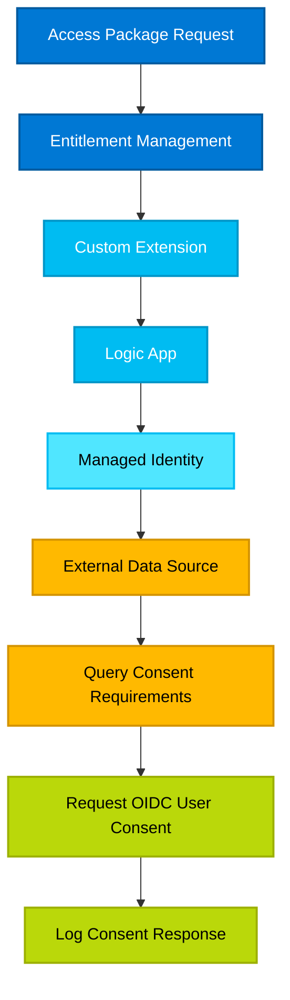

# OIDC Consents - Entitlement Management Custom Extension

This template demonstrates how to automatically request user consent when access packages are assigned using Entitlement Management custom extensions. The solution correlates access packages to specific OIDC consent requirements using an external data source.

---

## Overview

This solution uses:
- **Entitlement Management** to manage access package assignments
- **Custom Extension** to trigger consent request logic at specific stages
- **External Data Source** to correlate access packages to consent requirements
- **Logic App** to orchestrate the consent request workflow
- **Managed Identity** for secure, credential-free authentication

---

## Architecture



### Workflow Steps

1. **Access Package Request** - User requests access to resources
2. **Entitlement Management** - Evaluates the request against policies
3. **Custom Extension** - Triggers the consent workflow
4. **Logic App** - Orchestrates the consent process
5. **Managed Identity** - Provides secure authentication
6. **External Data Source** - Stores consent mappings
7. **Query Consent Requirements** - Retrieves required permissions
8. **Request OIDC User Consent** - Grants OAuth permissions
9. **Log Consent Response** - Records the consent action

---

## Part 1: External Data Source for Consent Correlation

### Why Use an External Data Source?

Access packages currently only supports a few types of access natively. Using an external data source to correlate access packages to a much larger set of object types. Below are the onjects that are supported natively:

1. **Groups**: M365 groups, Writeback groups, security groups, PIM enabled groups.
2. **Enterprise Apps**: Provision roles based on the roles in side the enterprise apps
3. **Entra roles - Preview**: Preview feature to automatically apply certain entra roles to users
4. **Sharepoint Sites**: Provision direct access to a sharepoint site instead of at the group level
5. **API Permissions - Preview**: For instance graph api permissions

All ofther permission/entitlement might need a look up table to correlate the object to an access package.

### Data Source Options

You can use any of the following data sources to store the consent correlation data:
1. Blob Tables -- what this Custom extension is going to use.
2. CSV file
3. MSSQL with On-premise Data Gateway
4. Or your own homegrown solution

### Creating the Azure Table

```

# Variables
$resourceGroup = "MyResourceGroup"
$location      = "EastUS"
$storageName   = "mystoragesta$(Get-Random)"   # must be globally unique and all lower case and numbers
$tableName     = "oidclookupGovernance"
$tenantid      = "xxxxxxxx-xxxx-xxxx-xxxx-xxxxxxxxxxxx"   # <-- your Tenant ID here


# Login to Azure
Connect-AzAccount -Tenant $tenantId

# Create Resource Group
New-AzResourceGroup -Name $resourceGroup -Location $location

# Create Storage Account
New-AzStorageAccount `
    -ResourceGroupName $resourceGroup `
    -Name $storageName `
    -Location $location `
    -SkuName Standard_LRS `
    -Kind StorageV2

# Get Storage Account context
$ctx = New-AzStorageContext -StorageAccountName $storageName -UseConnectedAccount

# Create Table
New-AzStorageTable -Name $tableName -Context $ctx

Write-Host "Storage account '$storageName' created with table '$tableName'"

```


### Selecting an Application to test
1. Find your application for instance ([Virus Total](https://www.virustotal.com/gui/sign-in))
2. Sign in with your test account. View the OIDC application consents and accept these values
3. Go to the enterprise application blade in Entra and find Virus Total (VT SSO)
4. **Permissions** on the Left side. Then **User consents** and view the recorded permissions. Save these for later; you will need it when filling out the blob storage


## Part 1: Creating a Custom Extension in Entitlement Management

### Step 1: Navigate to Entitlement Management

1. Open **Entra ID Admin Center** ([https://entra.microsoft.com](https://entra.microsoft.com))
2. Navigate to **Identity Governance** → **Entitlement Management**
3. In the left navigation, click **Catalogs** then select your catalog you want
4. In the left navigation, click **Custom extensions**
5. Click **Add custom extension**

### Step 2: Configure Basic Settings

1. **Name**: Enter `OIDC-Consent-Extension`
2. **Description**: Enter `Requests user consent based on access package assignment`
3. **Extension Type**: Select **Request workflow**
4. **Extension Configuration**: Select **Launch and continue**
5. **Details**: Create logic app, then select your subscription, Resource group and logic app name `entitlement-consent-extension`
6. **Create a logic app** then review and create to finish


### Step 3: Import Logic App JSON Workflow

#### Option A: Replace Entire Workflow Definition

1. In **Code view**, select all the existing JSON code (Ctrl+A)
2. Delete the existing code
3. Paste your complete Logic App JSON definition (see json code below)
4. Click **Save**

```
{
    "definition": {
        "$schema": "https://schema.management.azure.com/providers/Microsoft.Logic/schemas/2016-06-01/workflowdefinition.json#",
        "contentVersion": "1.0.0.0",
        "triggers": {
            "manual": {
                "type": "Request",
                "kind": "Http",
                "inputs": {
                    "schema": {
                        "type": "object",
                        "properties": {
                            "AccessPackageAssignmentRequestId": {
                                "type": "string"
                            },
                            "CallbackUriPath": {
                                "type": "string"
                            },
                            "CustomExtensionStageInstanceId": {
                                "type": "string"
                            },
                            "Stage": {
                                "type": "string"
                            },
                            "RequestType": {
                                "type": "string"
                            },
                            "Answers": {
                                "type": "array"
                            },
                            "State": {
                                "type": "string"
                            },
                            "Status": {
                                "type": "string"
                            },
                            "CallbackConfiguration": {
                                "type": "object",
                                "properties": {
                                    "DurationBeforeTimeout": {
                                        "type": "string"
                                    }
                                }
                            },
                            "AccessPackage": {
                                "type": "object",
                                "properties": {
                                    "Id": {
                                        "type": "string",
                                        "description": "AccessPackage-Id"
                                    },
                                    "DisplayName": {
                                        "type": "string",
                                        "description": "AccessPackage-DisplayName"
                                    },
                                    "Description": {
                                        "type": "string",
                                        "description": "AccessPackage-Description"
                                    }
                                }
                            },
                            "AccessPackageCatalog": {
                                "type": "object",
                                "properties": {
                                    "Id": {
                                        "type": "string",
                                        "description": "AccessPackageCatalog-Id"
                                    },
                                    "DisplayName": {
                                        "type": "string",
                                        "description": "AccessPackageCatalog-DisplayName"
                                    },
                                    "Description": {
                                        "type": "string",
                                        "description": "AccessPackageCatalog-Description"
                                    }
                                }
                            },
                            "Assignment": {
                                "type": "object",
                                "properties": {
                                    "Id": {
                                        "type": "string",
                                        "description": "Assignment-Id"
                                    },
                                    "Target": {
                                        "type": "object",
                                        "properties": {
                                            "ConnectedOrganization": {
                                                "type": "object",
                                                "properties": {
                                                    "Id": {
                                                        "type": "string",
                                                        "description": "Assignment-Target-ConnectedOrganization-Id"
                                                    },
                                                    "DisplayName": {
                                                        "type": "string",
                                                        "description": "Assignment-Target-ConnectedOrganization-DisplayName"
                                                    },
                                                    "Description": {
                                                        "type": "string",
                                                        "description": "Assignment-Target-ConnectedOrganization-Description"
                                                    }
                                                }
                                            },
                                            "Id": {
                                                "type": "string",
                                                "description": "Assignment-Target-Id"
                                            },
                                            "ObjectId": {
                                                "type": "string",
                                                "description": "Assignment-Target-ObjectId"
                                            },
                                            "DisplayName": {
                                                "type": "string",
                                                "description": "Assignment-Target-DisplayName"
                                            }
                                        }
                                    },
                                    "State": {
                                        "type": "string",
                                        "description": "Assignment-State"
                                    },
                                    "Status": {
                                        "type": "string",
                                        "description": "Assignment-Status"
                                    },
                                    "AssignmentPolicy": {
                                        "type": "object",
                                        "properties": {
                                            "Id": {
                                                "type": "string",
                                                "description": "AssignmentPolicy-Id"
                                            },
                                            "DisplayName": {
                                                "type": "string",
                                                "description": "AssignmentPolicy-DisplayName"
                                            }
                                        }
                                    }
                                }
                            },
                            "Requestor": {
                                "type": "object",
                                "properties": {
                                    "Id": {
                                        "type": "string",
                                        "description": "Requestor-Id"
                                    },
                                    "ObjectId": {
                                        "type": "string",
                                        "description": "Requestor-ObjectId"
                                    },
                                    "DisplayName": {
                                        "type": "string",
                                        "description": "Requestor-DisplayName"
                                    }
                                }
                            }
                        }
                    }
                },
                "operationOptions": "IncludeAuthorizationHeadersInOutputs"
            }
        },
        "actions": {
            "Get_Resource_assigned_to_Package": {
                "runAfter": {
                    "Initialize_storage_variables": [
                        "Succeeded"
                    ]
                },
                "type": "Http",
                "inputs": {
                    "uri": "https://graph.microsoft.com/beta/identityGovernance/entitlementManagement/accessPackages/@{triggerBody()?['AccessPackage']?['Id']}?$expand=accessPackageResourceRoleScopes($expand=accessPackageResourceRole,accessPackageResourceScope)",
                    "method": "GET",
                    "authentication": {
                        "type": "ManagedServiceIdentity",
                        "audience": "https://graph.microsoft.com"
                    }
                },
                "runtimeConfiguration": {
                    "contentTransfer": {
                        "transferMode": "Chunked"
                    }
                }
            },
            "Parse_Access_package_response": {
                "runAfter": {
                    "Get_Resource_assigned_to_Package": [
                        "Succeeded"
                    ]
                },
                "type": "ParseJson",
                "inputs": {
                    "content": "@body('Get_Resource_assigned_to_Package')",
                    "schema": {
                        "type": "object",
                        "properties": {
                            "accessPackageResourceRoleScopes": {
                                "type": "array",
                                "items": {
                                    "type": "object",
                                    "properties": {
                                        "accessPackageResourceRole": {
                                            "type": "object",
                                            "properties": {
                                                "originId": {
                                                    "type": "string"
                                                }
                                            },
                                            "required": [
                                                "originId"
                                            ]
                                        }
                                    },
                                    "required": [
                                        "accessPackageResourceRole"
                                    ]
                                }
                            }
                        },
                        "required": [
                            "accessPackageResourceRoleScopes"
                        ]
                    }
                }
            },
            "For_each_1": {
                "foreach": "@outputs('Parse_Access_package_response')?['body']?['accessPackageResourceRoleScopes']",
                "actions": {
                    "Condition": {
                        "actions": {
                            "Is_Removed_Stage": {
                                "actions": {
                                    "Set_Permissions": {
                                        "type": "Http",
                                        "inputs": {
                                            "uri": "https://graph.microsoft.com/v1.0/oauth2PermissionGrants",
                                            "method": "POST",
                                            "body": {
                                                "clientId": "@{item()['accessPackageResourceRole']['originId']}",
                                                "consentType": "Principal",
                                                "resourceId": "@{body('Parse_JSON')?['resourceid']}",
                                                "principalId": "@{triggerBody()?['Assignment']?['Target']?['ObjectId']}",
                                                "scope": "@{body('Parse_JSON')?['permissions']}"
                                            },
                                            "authentication": {
                                                "type": "ManagedServiceIdentity",
                                                "audience": "https://graph.microsoft.com"
                                            }
                                        },
                                        "runtimeConfiguration": {
                                            "contentTransfer": {
                                                "transferMode": "Chunked"
                                            }
                                        }
                                    }
                                },
                                "else": {
                                    "actions": {
                                        "Get_permissions_PER_user_Per_APP": {
                                            "type": "Http",
                                            "inputs": {
                                                "uri": "https://graph.microsoft.com/v1.0/oauth2PermissionGrants?%24filter=clientid+eq+'@{item()['accessPackageResourceRole']['originId']}'+and+principalId+eq+'@{triggerBody()?['Assignment']?['Target']?['ObjectId']}'",
                                                "method": "GET",
                                                "authentication": {
                                                    "type": "ManagedServiceIdentity",
                                                    "audience": "https://graph.microsoft.com/"
                                                }
                                            },
                                            "runtimeConfiguration": {
                                                "contentTransfer": {
                                                    "transferMode": "Chunked"
                                                }
                                            }
                                        },
                                        "Parse_individual_ODIC_PERM": {
                                            "runAfter": {
                                                "Get_permissions_PER_user_Per_APP": [
                                                    "Succeeded"
                                                ]
                                            },
                                            "type": "ParseJson",
                                            "inputs": {
                                                "content": "@body('Get_permissions_PER_user_Per_APP')",
                                                "schema": {
                                                    "type": "object",
                                                    "properties": {
                                                        "value": {
                                                            "type": "array",
                                                            "items": {
                                                                "type": "object",
                                                                "properties": {
                                                                    "id": {
                                                                        "type": "string"
                                                                    }
                                                                },
                                                                "required": [
                                                                    "id"
                                                                ]
                                                            }
                                                        }
                                                    },
                                                    "required": [
                                                        "value"
                                                    ]
                                                }
                                            }
                                        },
                                        "For_each": {
                                            "foreach": "@outputs('Parse_individual_ODIC_PERM')?['body']?['value']",
                                            "actions": {
                                                "Delete_permissions_4_odic": {
                                                    "type": "Http",
                                                    "inputs": {
                                                        "uri": "https://graph.microsoft.com/v1.0/oauth2PermissionGrants/@{items('For_each')?['id']}",
                                                        "method": "DELETE",
                                                        "authentication": {
                                                            "type": "ManagedServiceIdentity",
                                                            "audience": "https://graph.microsoft.com"
                                                        }
                                                    },
                                                    "runtimeConfiguration": {
                                                        "contentTransfer": {
                                                            "transferMode": "Chunked"
                                                        }
                                                    }
                                                }
                                            },
                                            "runAfter": {
                                                "Parse_individual_ODIC_PERM": [
                                                    "Succeeded"
                                                ]
                                            },
                                            "type": "Foreach"
                                        }
                                    }
                                },
                                "expression": {
                                    "and": [
                                        {
                                            "not": {
                                                "equals": [
                                                    "@triggerBody()?['Stage']",
                                                    "AssignmentRemoved"
                                                ]
                                            }
                                        }
                                    ]
                                },
                                "type": "If"
                            }
                        },
                        "runAfter": {
                            "Parse_JSON": [
                                "Succeeded",
                                "Failed"
                            ]
                        },
                        "else": {
                            "actions": {}
                        },
                        "expression": {
                            "and": [
                                {
                                    "not": {
                                        "equals": [
                                            "@body('Parse_JSON')?['permissions']",
                                            "@null"
                                        ]
                                    }
                                }
                            ]
                        },
                        "type": "If"
                    },
                    "Get_entity_(V2)": {
                        "type": "ApiConnection",
                        "inputs": {
                            "host": {
                                "connection": {
                                    "name": "@parameters('$connections')['azuretables']['connectionId']"
                                }
                            },
                            "method": "get",
                            "path": "/v2/storageAccounts/@{encodeURIComponent(encodeURIComponent(variables('BlobTableEndpoint')))}/tables/@{encodeURIComponent(variables('TableName'))}/entities(PartitionKey='@{encodeURIComponent('ODICUserConcents')}',RowKey='@{encodeURIComponent(item()['accessPackageResourceRole']['originId'])}')",
                            "queries": {
                                "$select": "permissions, resourceid"
                            }
                        }
                    },
                    "Parse_JSON": {
                        "runAfter": {
                            "Get_entity_(V2)": [
                                "Succeeded",
                                "Failed"
                            ]
                        },
                        "type": "ParseJson",
                        "inputs": {
                            "content": "@body('Get_entity_(V2)')",
                            "schema": {
                                "type": "object",
                                "properties": {
                                    "odata.metadata": {
                                        "type": "string"
                                    },
                                    "odata.etag": {
                                        "type": "string"
                                    },
                                    "permissions": {
                                        "type": "string"
                                    },
                                    "resourceid": {
                                        "type": "string"
                                    }
                                }
                            }
                        }
                    }
                },
                "runAfter": {
                    "Parse_Access_package_response": [
                        "Succeeded"
                    ]
                },
                "type": "Foreach"
            },
            "Initialize_storage_variables": {
                "runAfter": {},
                "type": "InitializeVariable",
                "inputs": {
                    "variables": [
                        {
                            "name": "BlobTableEndpoint",
                            "type": "string",
                            "value": "basta2112461141"
                        },
                        {
                            "name": "TableName",
                            "type": "string",
                            "value": "odiclookupGovernance"
                        }
                    ]
                }
            }
        },
        "outputs": {},
        "parameters": {
            "$connections": {
                "type": "Object",
                "defaultValue": {}
            }
        }
    
    }
}

```


## Part 6: Enabling Managed Identity

### What is a Managed Identity?

A **Managed Identity** is an Azure feature that provides Azure resources with an automatically managed identity in Entra ID. It eliminates the need to store credentials.

Benefits:
- **No credential management**: Azure handles credential rotation
- **Secure**: Credentials never appear in code or configs
- **Integrated**: Works with Azure services and Microsoft Graph
- **Auditable**: All actions logged with managed identity

### Step 1: Enable System-Assigned Managed Identity

#### Using Azure Portal

1. Open your Logic App: `entitlement-consent-extension`
2. Navigate to **Settings** → **Identity**
3. Under **System assigned** tab:
   - Toggle **Status** to **On**
   - Click **Save**
   - Confirm by clicking **Yes**
4. Once enabled, an **Object (principal) ID** will be displayed

## Part 7: Assigning Permissions to Managed Identity

### Required Permissions

The managed identity needs different permissions based on your data source and consent requirements:

#### Core Permissions (All Scenarios):

1. **DelegatedPermissionGrant.ReadWrite.All**: Manage all delegated permission grants
2. **EntitlementManagement.Read.All**: To read access package details

#### PowerShell script

```

Install-Module Microsoft.Graph -Scope CurrentUser

Connect-MgGraph -Scopes "Application.Read.All","AppRoleAssignment.ReadWrite.All,RoleManagement.ReadWrite.Directory"
$graphApp = Get-MgServicePrincipal -Filter "AppId eq '00000003-0000-0000-c000-000000000000'"

$PermissionName = "DelegatedPermissionGrant.ReadWrite.All"
$AppRole = $graphApp.AppRoles | Where-Object {$_.Value -eq $PermissionName -and $_.AllowedMemberTypes -contains "Application"}
$managedID = Get-MgServicePrincipal -Filter "DisplayName eq 'entitlement-consent-extension'"
New-MgServicePrincipalAppRoleAssignment -PrincipalId $managedID.Id -ServicePrincipalId $managedID.Id -ResourceId $graphApp.Id -AppRoleId $AppRole.Id

$PermissionName = "EntitlementManagement.Read.All"
$AppRole = $graphApp.AppRoles | Where-Object {$_.Value -eq $PermissionName -and $_.AllowedMemberTypes -contains "Application"}
$managedID = Get-MgServicePrincipal -Filter "DisplayName eq 'entitlement-consent-extension'"
New-MgServicePrincipalAppRoleAssignment -PrincipalId $managedID.Id -ServicePrincipalId $managedID.Id -ResourceId $graphApp.Id -AppRoleId $AppRole.Id

```

### Step 5: Grant Data Source Access

#### Create Azure Storage Table:

```
# Variables
$resourceGroup = "MyResourceGroup"
$location      = "EastUS"
$storageName   = "mystoragename$(Get-Random)"   # must be globally unique and all lower case and numbers
$tableName     = "oidclookupGovernance"
$tenantid      = "YourEntraTenantID"

# Login to Azure
Connect-AzAccount -Tenant $tenantId

# Create Resource Group
New-AzResourceGroup -Name $resourceGroup -Location $location

# Create Storage Account
New-AzStorageAccount `
    -ResourceGroupName $resourceGroup `
    -Name $storageName `
    -Location $location `
    -SkuName Standard_LRS `
    -Kind StorageV2

# Get Storage Account context
$ctx = New-AzStorageContext -StorageAccountName $storageName -UseConnectedAccount

# Create Table
New-AzStorageTable -Name $tableName -Context $ctx

Write-Host "Storage account '$storageName' created with table '$tableName'"

```

### Add permissions

```

# Grant Storage Table Data Reader role
$storageAccountName      = "YOUR_STORAGE_ACCOUNT"
$resourceGroupName       = "YOUR_RESOURCE_GROUP"
$managedIdentityObjectId = "YOUR_OBJECT_ID" # Custom extension's managed identity

# Get the Storage Account
$storageAccount = Get-AzStorageAccount -ResourceGroupName $resourceGroupName -Name $storageAccountName

# Grant Reader to the Managed Identity
New-AzRoleAssignment -ObjectId $managedIdentityObjectId `
    -RoleDefinitionName "Storage Table Data Reader" `
    -Scope $storageAccount.Id

Write-Host "Granted Storage Table Data Reader access to Managed Identity" -ForegroundColor Green

# Get the current user’s ObjectId
$currentUser = (Get-AzContext).Account.Id
$currentUserObject = Get-AzADUser -UserPrincipalName $currentUser

# Grant Contributor to the current user
New-AzRoleAssignment -ObjectId $currentUserObject.Id `
    -RoleDefinitionName "Storage Table Data Contributor" `
    -Scope $storageAccount.Id

Write-Host "Granted Storage Table Data Contributor access to current user" -ForegroundColor Green


```
### Step 6: Fix the Get entity V2 account issues

1. Delete the **Get Entity (V2)** step
2. Readd the  **Get Entity (V2)** for Azure Table storage, Fill in the following information

> [!Note]
> Both Storage Account Name and Table you need to select custom before pasting the information below.

#### Partion Key

```
OIDCUserConsents
```
#### Row Key

```
@{item()['accessPackageResourceRole']['originId']}
```

#### Storage Account Name or Table Name
```
@{variables('BlobTableEndpoint')}
```
#### Table 
```
@{variables('TableName')}
```
#### Advanced Parameters - Select Query
```
permissions, resourceid
```


3. Replace the next step **Parse Json**  contect with the follow

```
@{body('Get_entity_(V2)')}
```

4. Save the workflow and make sure there is no issues displaying in the Logic app designer


## Part 8: Configuring Access Packages to Use Custom Extension

### Step 1: Navigate to Access Package

1. In **Entra ID Admin Center**, go to **Identity Governance** → **Entitlement Management**
2. Click **Access packages**
3. Select the access package you want to add consent requirements to

### Step 2: Edit Access Package Policy

1. Click on the policy you want to modify (or create a new one)
2. Scroll to **Custom extensions** section
3. Click **Add custom extension**

### Step 3: Configure Custom Extension for Policy

1. **Select custom extension**: Choose `OIDC-Consent-Extension`
2. **Stage**: is **Assignment is granted** 
3. Select another **Stage**: and select **Assignment is removed**
4. Click **Save**

---

## Part 9: Add the VT SSO Enterprise Application to the Access Package

### Step 1: Navigate to the Access Package

1. Open **Entra ID Admin Center** ([https://entra.microsoft.com](https://entra.microsoft.com))
2. Navigate to **Identity Governance** → **Entitlement Management**
3. Click **Catalogs** and select the catalog containing your access package
4. Click **Access packages**
5. Select the access package you want to modify (or the one you just configured with the custom extension)

### Step 2: Add Resource to Access Package

1. In the access package details, click **Resource roles** in the left navigation
2. Click **+ Add resource roles**
3. In the **Select resource type** dropdown, select **Applications**

### Step 3: Select the Enterprise Application

1. In the **Select application** search box, type the name of your VT SSO enterprise application
2. Click on the application from the search results to select it
3. The application details will appear on the right side

## Adding the Access package ID and permissions blob table

1. Copy the Access package object ID which is at the overview page of each access package. 
2. Go to the blob storage table --> your storage account then **Storage Browser** then **table** and edit the table created.
3. Find the resource ID of an application via Graph

```
GET https://graph.microsoft.com/v1.0/oauth2PermissionGrants?$filter=clientid+eq+’{ObjectID}’
```

3. Add the following data into your table (you will need to add the Permission column and the OIDC permissions are going to be different for each app)


| Partition Key | Row Key | Permissions | ResourceID |
|-----------------|------------------|-------------------|------------------|
| `OIDCUserConsents` | Enterprise Application Object ID | profile email openid User.Read | 2be0b995-bef9-4618-9e2e-18538e8308c7 |

4. Update the Logic app step **Initialize storage variables** with your **BlobTableEndpoint** and Optionally **TableName** if you used an existing table

---

## Part 10: Requesting Access Through the Access Package Assignment Page

Once the access package has been configured with the custom extension and resources, users can request access through the MyAccess portal. The custom extension will automatically handle OIDC consent during the assignment process.

> [!Note]
> This is designed to work with user application concent in the most restrictive mode. **Enterprise Application** --> **Consent and Permissions** --> **User Consent Settings** --> Set it to **Do not allow user consent**

### Step 1: Access the MyAccess Portal

1. Navigate to **MyAccess portal**: [https://myaccess.microsoft.com](https://myaccess.microsoft.com)
2. Sign in with your organizational account
3. You'll land on the **My Access** home page

### Step 2: Browse Available Access Packages

1. In the MyAccess portal, click **Access packages** in the left navigation menu
2. You'll see a list of all available access packages you can request
3. Use the search box to filter for specific packages, or browse through the catalog
4. Click on the access package name to view its details

### Step 3: Request Access to the Package

1. On the access package details page, review:
   - **Description**: What the access package provides
   - **Resources**: What applications and groups are included
   - **Policy information**: Request requirements and approval settings
   - **Duration**: How long the access will last

2. Click the **Request access** button
3. If multiple policies are available, select the appropriate policy for your request
4. Fill out any required information:
   - **Business justification**: Explain why you need access
   - **Custom questions**: Answer any additional questions configured by the administrator
   - **Duration**: Select the duration if configurable

5. Review your request details
6. Click **Submit** to send your request

### Step 4: Approval Process (If Required)

If the access package requires approval:
1. You'll see a message indicating your request has been submitted
2. Designated approvers will receive a notification
3. Track your request status in **My Access** → **Requests** → **Pending approvals**
4. You'll receive an email notification once your request is approved or denied

### Step 5: Automatic OIDC Consent Assignment

Once your access request is approved (or auto-approved):
1. The custom extension will automatically trigger
2. The Logic App will:
   - Look up the access package in the Azure Table Storage
   - Identify the required OIDC permissions for the application
   - Grant the consent on your behalf using the permissions configured in the table
3. This happens automatically in the background - no additional user interaction needed

### Step 6: Access the Application

After the assignment is complete:
1. You'll receive a confirmation email
2. The application will appear in your **My Apps** portal: [https://myapps.microsoft.com](https://myapps.microsoft.com)
3. Click on the application icon to launch it
4. Since the OIDC consent was already granted via the custom extension, you won't be prompted for consent
5. You'll be signed in automatically with the appropriate permissions
---

## Part 11: Testing Access Package Assignment Removal

Testing the removal process ensures that OIDC permissions are properly revoked when access is removed.

### Step 1: Remove an Active Assignment (Administrator)

As an administrator, you can test the removal process:

1. Navigate to **Entra ID Admin Center** ([https://entra.microsoft.com](https://entra.microsoft.com))
2. Go to **Identity Governance** → **Entitlement Management**
3. Click **Access packages**
4. Select the access package with the OIDC consent extension
5. Click **Assignments** in the left menu
6. Find the user assignment you want to remove
7. Select the assignment and click **Remove access**
8. Confirm the removal

### Step 2: Verify Custom Extension Triggered

After removing the assignment:

1. Navigate to your Logic App: `entitlement-consent-extension`
2. Click **Overview** → **Runs history**
3. Look for a recent run triggered by the removal
4. Click on the run to view details
5. Verify that:
   - The trigger shows `Stage: "AssignmentRemoved"`
   - The workflow executed the removal path in the **Is_Removed_Stage** condition
   - The **Get_permissions_PER_user_Per_APP** action was executed
   - The **Delete_permissions_4_odic** action successfully removed the OIDC permissions

### Step 3: Verify OIDC Permissions Were Revoked

Check that the user's OIDC permissions were actually removed:

1. Go back to the enterprise application
2. Click on Permissions on the left
3. Check what the user consents are.


